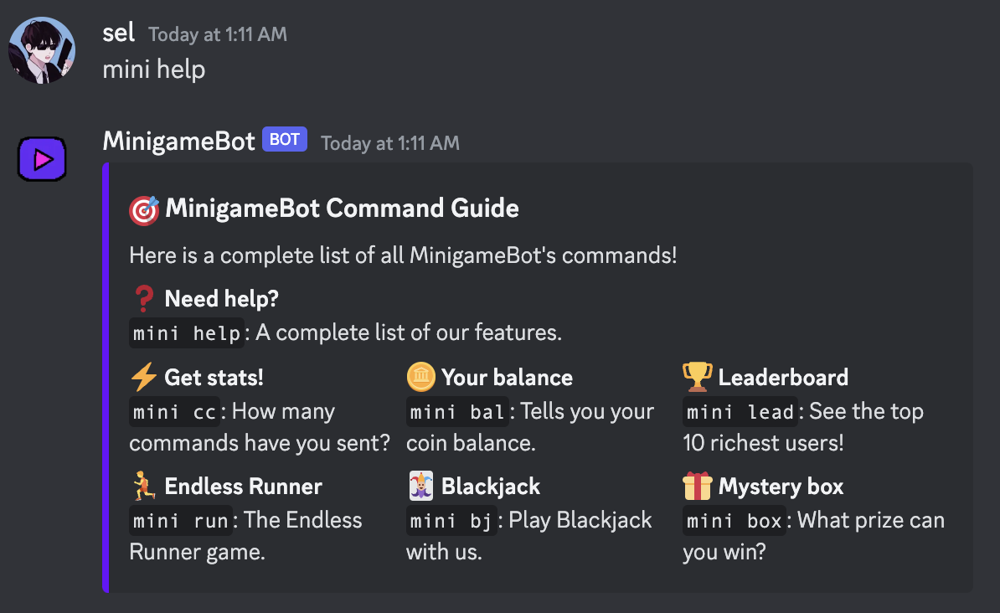

# Minigame Bot

> Selena Zhou, May 2023

## Description

Minigame Bot is a Discord bot written in Python that hosts a variety of embedded text minigames.

#### TODO:
- [x] User command count (connect with Firestore DB)
- [x] Coin purse and balance (connect with Firestore DB)
- [ ] Leaderboard for coins (connect with Firestore DB)
- [ ] Classic 'endless runner' game (embedded in message, with react controls)
- [ ] Blackjack game (embedded in message, with reacts)
- [ ] Mystery box randomizer
- [ ] Connect to hosting (e.g. Heroku) to keep bot running

## Purpose

The purpose of this project is to familiarize myself with writing bots through Discord API,
and to practice using Firestore cloud storage to store information in real time.

## Gameplay

## Tags

**Softwares:** Python, Firestore DB, Discord API

**Topic:** Bot development
